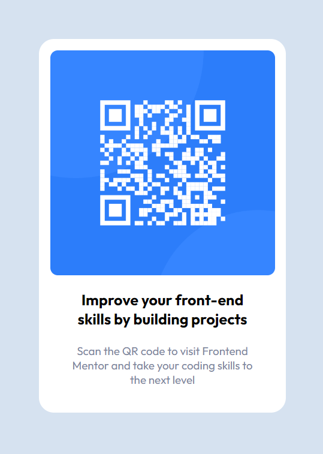

# Frontend Mentor - QR code component solution

This is a solution to the [QR code component challenge on Frontend Mentor](https://www.frontendmentor.io/challenges/qr-code-component-iux_sIO_H). Frontend Mentor challenges help you improve your coding skills by building realistic projects.

## Table of contents

- [Overview](#overview)
  - [Screenshot](#screenshot)
  - [Links](#links)
- [My process](#my-process)
  - [Built with](#built-with)
  - [What I learned](#what-i-learned)
- [Author](#author)

## Overview

### Screenshot

### The challenge

This challenge is a component to scan a QR code.

This is the result of challenge.

### Links

- Solution: [Git Hub](https://github.com/marco-moya/QR-code-component.git)
- Live Site: [Git Hib Pages](https://marco-moya.github.io/QR-code-component.git)

## My process

### Built with

- Semantic HTML5 markup
- CSS custom properties
- Flexbox
- Mobile-first workflow

### What I learned

In this challenge I used the knowledge basic for flexbox to center all elements as horizontal and vertical.

## Author

- Frontend Mentor - [@marco-moya](https://www.frontendmentor.io/profile/marco-moya)
